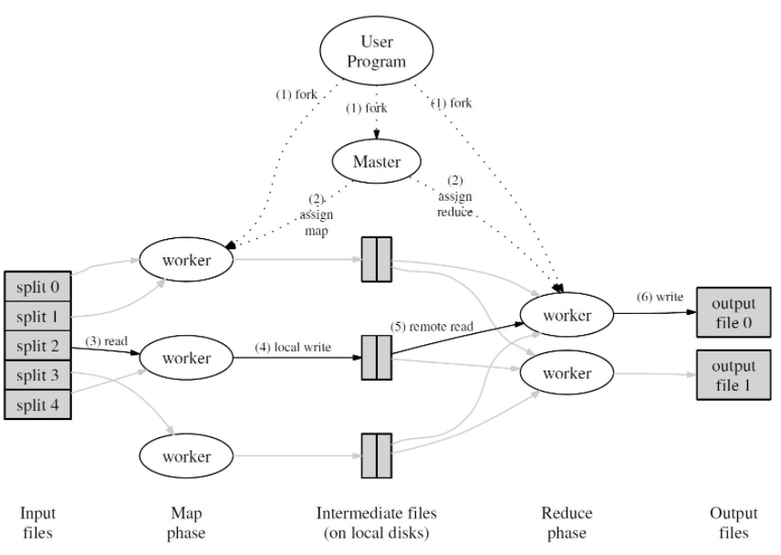
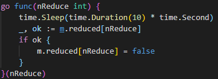

<h1> MapReduce </h1>

<h2>Summary</h2>

<h3>Topics about Distributed Systems </h3>

+ Infrastructure
  + Storage
  + Communication
  + Computation
+ Performance
  + Scalability
+ Fault Tolerance
+ Consistency
  + strong consistency
  + weak consistency

+ MapReduce

<h3> About MapReduce

TL;DR -- Google's engineers build a model that implements the split and dispatch process to make large scale computation tasks easy programmed. (Just need to write map() and reduce() function)

​	

You can find the detailed model description in **MapReduce: Simplified Data Processing on Large Clusters**

<h4>Brief Execution flow

1. Split the *input files* into M splits, which is generally 16-64 MB in size. And they are the basic unit one worker handles
2. We set up a **master** process to schedule the workflows of each worker, it will pass the *split* to idle worker (In fact the true process should be worker calls the master for a job)
3. Worker do their Map() job, and  the output of Map() should be <key, value> pair. 
4.  Store the *Intermediate output* on local disks (like json,etc).  AND!! Here is a trick that usually we need have R final reduced files, so we have to partition these <key,value> pairs into R parts. (Use hash(key) **mod** R)
5. Master received the *intermediate files* locations and once all the input files are processed. Master will assign Reduce() job to workers
6. Workers do the Reduce() job and output the final result on disk

​	

<h3>Some Hints on Lab1</h3>

Claim: Below is all my own solution, and maybe happen to pass all tests. :)

+ Enviornment Requirement
  + GOLANG, **You shall have basic golang knowledge like slice, map 's insert, delete, find... Also should know a little bit concurrency programming(just know what mutex mean hah), RPC programming...**
  + linux 64bit
  + For Chinese mainland students, if you are using vscode, you may have trouble install golang extensions in vscode. **Google the problem, CSDN sucks**

+ About master.go

  + Checked input files **map** when a worker calls for job, also applicable for reduce job
  + **Recovery Problem**: in master, I run a timecount gorountine for each assigned job, if the worker does not report on time, just modify todo list and assign it to the later worker( of course the former worker's job is abandoned) 
  + If all map tasks are assigned, but not completed, just tell idle workers WAIT.
  + If reduced tasks are all done, tell idle workers QUIT
  + Don't forget to lock up the critical area

+ About worker.go

  + use a loop to constantly getJob, and if master tells worker QUIT,  then quit(Also WAIT, then wait)
  + Because each worker just read the seperate file, there is no synchronize problem when read
  + But for these worker on write, there is chance that abandoned worker is write the same file alone with new assigned worker**You should be careful when write the intermediate/output file**

+ About lambda function with goroutine

  

  ​											 Use my goroutine function for example*

  When write lamda function, there is a trick that **you should write these variable which you don't want them be changed outside the lambda funtion as function's parameter** This is because that compiler will put the local variable(these used in lambda function) on heap NOT STACK, so once the variable is changed outside, the thread will read the changed variable. This is sometimes you don't wanna see. 

  

  