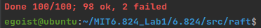
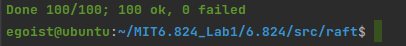

<h1>Conclusion</h1>
After finish 3 parts of Lab, I have implemented a basic raft protocol and it can used to build a  K-V storage server. It is fascinating for its understandability and straight idea to build this consensus system. In past 3 parts, I achieved timeout election, append entries, persist and many subtle details to ensure the consistency. My implementation may seem somehow ungraceful especially when I looked the tutorial course 'Go thread and Raft', so I do recommend you to have a look at it before you start your first line of code.

| storage server 1 | storage server 2 | storage server 3 |
| :--------------: | :--------------: | :--------------: |
|   K/V service    |   K/V service    |   K/V service    |
|       Raft       |       Raft       |       Raft       |

In this distributed storage system, clients talk to application layer like K/V service, and application send <command> info to Raft to make distribute replicas. *Usually, Raft is a library to be included and easy used* 

<h3>
    Features of Raft
</h3>

* Fault Tolerance(using 2n + 1 servers)

  * To avoid **split brain**, adapt majority voting strategy. The basic logic is if there is a split brain, can not have both partitions own majority server. 

    In Raft's detail, it means that for new leader, it will assemble at least one server's vote which from previous majority. We should use one of those previous majority servers as new leader because we should ensure new leader must know what happened before(What term is before). 

<h2>TODO (ALL DONE)</h2> 

~~I still have some issues need to be addressed, some are performance related and some are many bugs(I don't know for sure, for me, I'd rather blame these FAIL to too strict test time restriction...)~~  

* Some time, many 1 out of 10 the test will fail, for the program can not reach agreement. And the reason is easy, timeout election can sometime spend much time to elect a leader. And followings are solutions, from my point.
  * Check if two peer are racing like, *one elected in Term x but in Term x + 1, another timeout and start a new round election*. For this situation, consider if timer triggers before you reset it
  * Sleep time is a mysterious number I've changed them for many times but still have some problem... Currently a fair sleep time is [200, 400] for heartbeat timeout and ~~[50, 100] for election timeout~~ 
  * Some threads' synchronization is implemented heavily so need a more soft way to achieve it(As I will describe afterwards)
* Some terrible codes need refactoring like substitute all channel by using condition variable and merge analogous code into one function. Especially, primary should become leader as long as it receives majority votes, not until all RPC calls return.

Now I have revised my Raft and uses [Test Script](https://gist.github.com/jonhoo/f686cacb4b9fe716d5aa) to test Lab 2 A + B + C 90 times, and result is passed all 90 tests.(I revised my code and continued my test from 10th test, *2 failed* is past recorded)

This time, I have some new things to write about

* In fact, we do not need to set extract timer for RequestVote RPC, I once set [50,100]ms range to wait for RPC return, but test result turned out not so well. What we actually need to do is reset timer before start a new election round (So if RPC not return on time, timer will just start next election)
* Apply interval time need to be considered carefully, because I once set 1000ms to apply new log to state machine, result are worse than 200ms'
* When you are encountered with a livelock, check your RequestVote handler. I implemented this function mistakenly and led to the follower with up-to-data log cannot win the election on time. (Specifically, you need to make sure your peer convert to follower whenever it receives a RPC whose term is greater than currentTerm)
* Check if your output channels are blocked and without receivers. Just uses channel with buffer(**Can anybody tell me if go can GC unused channel buffer after both sender and receiver quit?**)
* Oh, I finally did not revise my election part using condition variable, just used channel.

​															Result of a new 100 tests