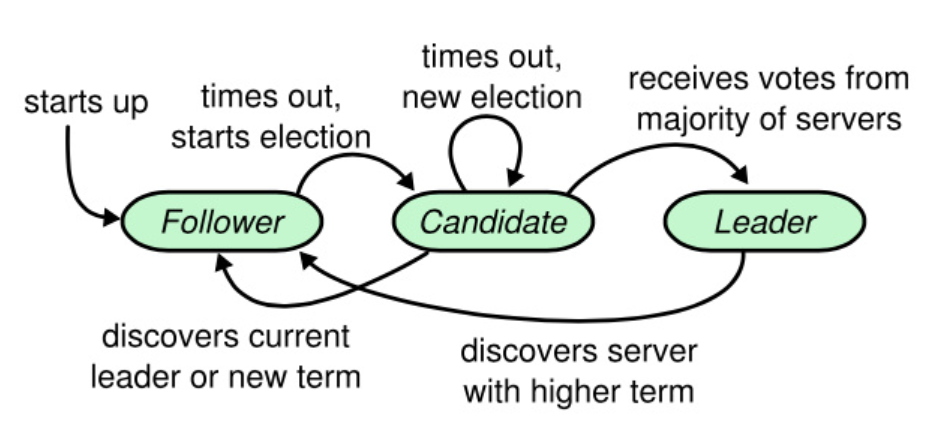

<h1> Raft</h1>

<h2>
    Paper Topics
</h2>

* Start with a Raft Protocol paper, [In Search of an Understandable Consensus Alogorithm]( http://nil.csail.mit.edu/6.824/2020/labs/lab-raft.html) , Also you can find Chinese version  [here](https://github.com/maemual/raft-zh_cn/blob/master/raft-zh_cn.md#51-raft-%E5%9F%BA%E7%A1%80)
* Raft Basics
  * Contain 3 kinds of servers : Follower, Candidate, Leader



* The Leader will be elected for each <**term**>, and term is the basic unit served as a Timer to denote the up-to-date log's time stamp


* Leader Election
  * Using the *election timeout* mechanism to make *Follower* begin a new round elction
  * To avoid **split votes**, Raft set the random *election timeout* for those server who calls a RequestVote() but one RPC call fails maybe due to the destination disconnect. 
* Log replication
  * Once become leader, leader receives command from client and appends the command to its log. Then calls AppendEntries RPC in parallel to notify followers


<h2> Lab2A
</h2>

In this part, we gonna establish a simplified raft just implements the leader election and leader sending heartbeat to maintain its status.

<h3>My implementation

* Set variables for each structure described in Figure 2. of the former paper

  *Raft Struct* & *RequestVote RPC* &*AppendEntries RPC*,  For Example:

```go 
type Raft struct {
	mu        sync.Mutex          // Lock to protect shared access to this peer's state
	peers     []*labrpc.ClientEnd // RPC end points of all peers
	persister *Persister          // Object to hold this peer's persisted state
	me        int                 // this peer's index into peers[]
	dead      int32               // set by Kill()

	// Your data here (2A, 2B, 2C).
	checkHeartBeat bool

	currentTerm int
	votedFor    int
	log         []int

	//Volatile
	commitIndex int
	lastApplied int
	//For leaders
	nextIndex  []int
	matchIndex []int
	status	   int
}
```

* Implement Make()

``` go
func Make(...) *Raft{
    setRf()
    go checkHeartBeat(){
        // if received Leader's HeartBeat then Sleep, nor begin a new election
        time.Sleep()
        if !heartBeatChecked() && !isLeader(){
            //timeOutElection part
            for each server in peers
            do
            	go sendRequestVote(server)// need set a timeout thread to makesure no longterm waiting
            done
            ...
            collectVoteInfo(){
                 if receives majority vote, become leader 
                	doLeader()
                 else back to Follower
            }
            
        }
    }
}
```

<h3>Hints

* MUST follow which variables paper described in data structure
* set mutex whenever there is a multithread R/W condition
* when call RPC, you should be aware of that caller will congest until RPC returns a true or false( which will take a **long time**), a good way to solve this is create a goroutine (For HeartBeat or RequestVote). To find this congestion took me long time repeating running test, I hope you won't.

* A simple script test of run 20 times 'go -test run 2A' 


<h2>Lab2B

This Part is much more difficult  than Lab2A...

 In 2B, we are about to implement AppendEntries. Specifically, for leader, it should send new log periodically to each follower(leader maintains each follower's *nextIndex* to send), for followers, check consistency of RPC's logs with attached *prevLog*, if *prevLog* doesn't match local log, reject this append and response to leader

* Fault Tolerance is the core part we should pay much attention to
* Commit the log to state machine whenever *commitIndex* is increased
*  We can not emphasize more the importance of stick to paper's figure2 !!!


<h3> Hints

* I revised my checkHeartBeat() as a timer, and the callback function is the timeOutElection
  * **I can not sure the exact performance difference between  former design and current one, but there are two point I want to claim**
  * Using the timer, it can make sure your callback function runs more periodically. **Consider if using goroutine, you will always start a timeout count after last timeout election ends. This time lag may result a livelock**
* **Make sure timer won't trigger callback when a peer receives RequestVote** or once a leader is elected, some other node starts an election **just because a little time latency to reset timer**, forcing the recently elected leader to abdicate immediately

* Set the election time out a  right  random range


<h3>Test Result


​																		*single test*


​																		*batch test*


<h2> Lab2C </h2>

If your former code is implemented well and free of bug, it is easy to complete persist() and readPersist() by reading example in comments.


<h3>Hints

* Check for 2B and 2A content if your code fails to pass the test.
* You should do persist() as long as your non-volatile variable is changed

