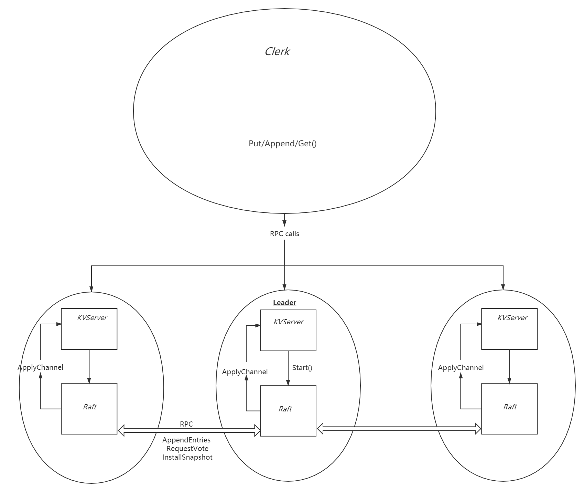
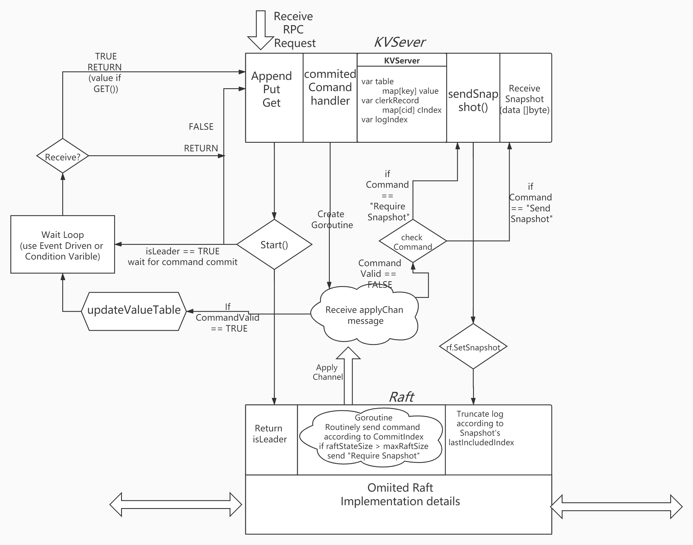
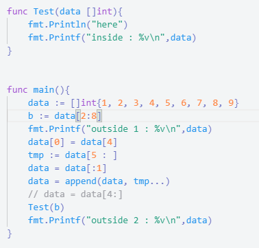
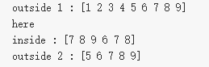

<h1>Conclusion</h1>

Lab3 is a tough journey, especially when you finish the whole framework, then problem just starts. I took roughly two days to complete my draft and spent 2-3 times time to debug.

In order to remind me of this hard time, spending hours reading 20000 lines log, suspecting each line I wrote and make you who are reading this avoid bugs or debug smoothly, I will write problems as explicit as I can.

To make my design easy to understand, I will start with design graph.


<h2> Structural Design</h2>







<h2> Specific Implementation</h2>

<h3> Overview</h3>

Because detailed Raft design is described in former part, so let's just assume we all pass Lab2 perfectly (Check it every time you modify Raft's code!)

* For KV Server
  * In 3A, we achieve the functions to send command and listen to channel till *Raft* peers reach agreement and persist the command, once *Server* receives specific message, it should execute the command(Without repetition).
  * In 3B, we will implement snapshot. This idea is straightforward but we need to overcome the side-effect it brings.
* For Raft
  * We need not modify our Raft design in 3A
  * In 3B, we should modify our code to deal with what Snapshot brings
    * the first problem is to make your *Raft* execute more fast to pass **TestSnapshotSize3B**. 
    * What time to tell KVServer to snapshot
    * Index Convert


<h3>Concrete Plan</h3>

<h4>KVServer</h4>

* To avoid repeating execution, assign each clerk an unique ID and mark each command a monotonically increasing sequence number. So *Server* can exam this info. which stored in *map* to decide whether execute.

* KVServer:: Get()  & PutAppend()

  A tricky implementation here is, in Get() we can achieve faster response by check the ClerkID's current sequence number to get value directly.

  You can do timeout check by **Receive a event of timer.After** or **Condition variable of check a count value**

* KVServer:: commitCommandHandler()

  A thread function to listen to appMsg Channel. If receives message, it will do **Valid check, Index check and Command check** to execute a command in right way.

  **Note:** Because the channel is a FIFO sequence, *Server*'s execution sequence is decided by Raft's push sequence. It's a nice point that we don't need to pay extra attention keep *Raft* and *KVServer* in sync, especially when *Raft* requires for a Snapshot in a very index.

* appMsg Channel with buffer
  * To make execution more efficient and decouple *Raft* and *KVServer*. We can preallocate a buffer for this channel so *Raft*'s log can be pipelined down into channel.
  * **Note:**Don't worry about inconsistency, *Server* will still execute in sequence and *Raft* will still get the right index's *Server's* state Snapshot.

<h4>Raft</h4>

* Remember to check your *Raft* first when you encounter a problem!!!(90% bug)

I actually don't wanna talk a lot about basic design here, for **InstallSnpshot RPC** is much similar as previous design. But there are still some point I want to record.

* To achieve high concurrency.

  * In previous part, I just make **HeartBeat & EntriesAppend** a same mechanism to send : goroutine check rf.log every 100ms and send new log if nextIndex[i] <= len(log) - 1.
  * Now we can add an extra send action in Start( )
  * **Note:** Be careful when you do so. Imagine a partition situation: a network-failed leader gonna send his log to others each time it receives new log. Once it's reconnected and receives info. from current leader and is ready to become follower, but  **sendAppendEntries** has been called. So a packet with up-to-dated term and false log will be received and accepted by other followers.
    * The problem is caused by checkStatus() step and sendAppendEntries() are not atomic, and in low concurrency situation this failure somehow are less likely to happen. 

* Time point of chitchat

  * *Server* should send *maxRaftState* to *Raft* during init(), each time Raft do a commit, it should check RaftStateSize and send signal if oversize.
  * Each time *Raft* truncates log, *lastApplied* should be changed as well as *IastIncludedIndex*
  * **Note:** I read other's Blog and they all mentioned one problem of deadlock which happens between Server and Raft. In my design, we don't need to worry about it, for each layer is working just at its own range. If you design a structure that Locks kv.mu and rf.mu in same time, you should be aware of the bad consequence it may cause.

* A weird slice reference problem happened on me

  * Problem description: Leader has a log : [A, B, C, D, E] for short, and in one moment, the AppendEntries log it send became : [C, D, C, D, E]. I checked locks and run hundreds of time of race detection with race-free. It costs nearly 1 day to locate and find reason.

  * If you aren't interested in this problem, just keep in mind: Golang's slice has a implicit mechanism of copy and truncate, each time you use **newdata = data[start :  end]**, you have the idea that newdata will be effected as long as data changed. The bug will sometimes even make no sense when you do more operation on newdata.

  * Now let me intro my bug:

    

    ​															Think about what Test will print

    * It seems slice are not allocate *b* a new space, so *b's* pointer is point to data's physical array[2], what makes thing worse is

      ```go
      data[0] = data[4]
      tmp := data[5 : ]
      data = data[:1]
      data = append(data, tmp...)
      ```

      also not assign a new memory to data. 

      

      ​														          So this is the result

    * But you can just use 

      ```go
      data = data[4:]
      ```

      to truncate your log, because it will allocate a new array to data.

    * Now let's check my code

      ```go
      /* Called by KVServer to set Snapshot*/
      func (rf *Raft) SetSnapshot(snapshot []byte, index int){
      	rf.mu.Lock()
      	defer rf.mu.Unlock()
      	if rf.lastIncludedIndex >= index {
      		return
      	}
      
      	//rf.log[0] = rf.log[rf.logIndexToArrayIndex(index)]
      	//tmp := rf.log[rf.logIndexToArrayIndex(index+1):]
      	//rf.log = rf.log[:1]
      	//rf.log = append(rf.log, tmp...)
      	rf.log = rf.log[rf.logIndexToArrayIndex(index) : ]
      	rf.lastIncludedIndex =  index
      	/*
      		Be careful, the lastApplied need to be updated as well
      	*/
      	rf.lastApplied = index
      	...
      }
      
      func (rf *Raft) startAppendEntries() {
      	//c := time.Now()
      	rf.mu.Lock()
      	if rf.status != LEADER{
      		rf.mu.Unlock()
      		return
      	}
      	index := len(rf.log) - 1 + rf.lastIncludedIndex
      	term := rf.currentTerm
      	leaderid := rf.me
      	leaderCommit := rf.commitIndex
      	for i := 0; i < len(rf.peers); i++ {
      		var logs []Pair
      		var prevLogIndex, prevLogTerm int
      		if i == leaderid {
      			continue
      		}
      		if rf.nextIndex[i] <= rf.lastIncludedIndex{
      			//gonna send snapshot
      			go func(i int, lastIncludedIndex int, lastIncludedTerm int, data []byte){
                      /* Install Snapshot RPC*/
      			...
      			}(i, rf.lastIncludedIndex, rf.log[0].Term, rf.persister.ReadSnapshot())
      			continue
      		}
      		if index < rf.nextIndex[i] {
      			prevLogIndex = index
      			prevLogTerm = rf.log[rf.logIndexToArrayIndex(prevLogIndex)].Term
      			
      		} else if index >= rf.nextIndex[i] {
      			logs = rf.log[rf.logIndexToArrayIndex(rf.nextIndex[i]) : rf.logIndexToArrayIndex(index+1)]
      			prevLogIndex = rf.nextIndex[i] - 1
      			prevLogTerm = rf.log[rf.logIndexToArrayIndex(prevLogIndex)].Term
      		}
      		go func(i int, prevTerm int, prevIndex int, logs []Pair) {
      			args := AppendEntriesArgs{
      				Term:         term,
      				LeaderId:     leaderid,
      				PrevLogIndex: prevIndex,
      				PrevLogTerm:  prevTerm,
      				Entries:      logs,
      				LeaderCommit: leaderCommit,
      			}
      			reply := AppendEntriesReply{}
      			ok := rf.sendAppendEntries(i, &args, &reply)
      			rf.mu.Lock()
                  ...
      			}
      			rf.mu.Unlock()
      		}(i, prevLogTerm, prevLogIndex, logs)
      	}
      	rf.mu.Unlock()
      }
      ```

      I just implicitly use the reference of log and pass it to the closure to call RPC. Although I lock the whole body of *startAppendEntries()*, the context within the closure is not atomic, so left log a time window to make change.

* When you encounter with other bugs: DPrint is a good helper  to locate errors, and make sure every variable  goes on track.

