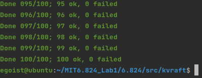

<h1> Lab3 </h1>

<h2>Overview</h2>

In this Lab, we are gonna build a Key/Value storage system based on raft, AKA KVRaft. In part A, just maintain a in memory Hashmap of Key -> Value and In part B, we need to deal with the growing Hashmap and use Snapshot to discard old log entries. Some details may be discussed in each section.

<h2>Lab3A</h2>

To implement a KVRaft, we use *clerk* to denote a interface the client calls to use K/V storage, *server* to denote  a peer among  K/V storage system which is based on Raft protocol. 

Particularly, we need to address of some detailed problems

* Leader find
  * Whether make server report to clerk which is leader(Not applicable for this lab)
* Repeat request
  * Like, send *append* request to a raft while due to the unreliable RPC, before receiving a commit server receives a "timeout". So when you are trying append secondly, you should  be careful not to append twice.
* Be careful of deadlock

<h3>Implementation</h3>

* To find leader, clerk just use randomized generate server_id to query for true leader, and once get positive response *clerk* will record this id for later use. 

  Furthermore, I want to explain why server not send a leader_id to clerk. In this lab3a,  the server list every clerk maintains are different as I *Dprint(ck.leader)* shows, which means there are not a standard leader_id for all clerk

* Generate a random id for each clerk and mark each operation a monotonic increasing sequence number to erase repeat.

  The erase repeating step should be processed in *server* level, not in *raft* level. 

  For these out-dated operation, because the sequence number for each clerk is monotonically increasing, server just skip manipulating the data but instead return positive

<h2>Lab3B</h2>

This time, we are gonna add snapshot feature to make raft discard old log entries. It requires us to modify our original Raft design and implement some new functions and *InstallSnapshot*.

In my structure,  KV server will tell Raft *maxRaftSize* , so when log's size is greater than this, Raft will notify server and require for a snaphot for *current_Index* (a tricky point is, because KV server receive msg from channel one after another, there won't be concurrency problem). And once KV server send a snapshot to Raft, Raft just save it and discard old entries.

When crash happens, Raft should send the newest snapshot to server.

<h3> Implementation</h3>

* Interface design
  * Raft :: SendMaxRaftState(), (To be called by Server)
  * Raft :: applyMsg{} :: Command -> "Require Snapshot"
  * Raft :: SendSnapshot(), (To be called by Server to send snapshot to Raft)
  * Raft :: applyMsg{} :: Command -> "Commit Snapshot"
*  Index convert
  * To discard old log,  we should keep **last Snapshoted Index**, I use *lastIncludedIndex* to denote it. When we do Snapshot or Install Snapshot, we all need reset *lastIncludedIndex*
  * Do index convert modification in each code uses rf.log
* Usage of snapshot
  * when Raft crashed and reboots, it should send KV server its snapshot and restart at *lastIncluded* index
  * if a leader detects one follower's nextindex falls too behind and its nextIndex is lower than truncated leader's index, Leader should send it a snapshot.
  * Every snapshot is accompanied with truncated index, if receiver's *lastIncludedIndex* is larger than the truncated index, then just return
* Some detailed hints
  * Raft need persist *lastInculudedIndex* just for restart use. **When lastIncludedIndex changed, lastApplied need to be updated as well**
  * Chitchat point between KVServer and Raft.  
    * Raft will send appMsg to KVServer to keep in synch. overall
    * To send snapshot, KVServer calls Raft's public interface
    * I will describe these in detail in **Conclusion**.md

Test Results:

100 times batch test:

