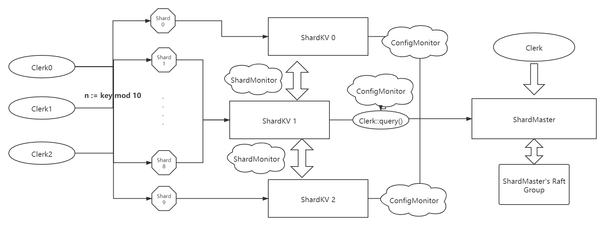

<h1> Conclusion</h1>

In this part, I will illustrate more detailed implementation of ShardKV based on the expectation that you have read the lab4 and know the basic idea of the framework. And I will describe following the sequence of a message sent by Clerk and to each part of Raft Group.




<h2> Implementation</h2>

<h3>ShardKV</h3>

As we described previously, we should maintain a Shard Map, config & lastConfig information in each Raft Group to complete 3 main functions.

```go
type ShardKV struct{
    ...
    chanMap     map[int] chan Op
	lastcfg     shardmaster.Config
	cfg         shardmaster.Config
	servedShard map[int]Shard
}

type Shard struct{
    Table map[string]string
	ClerkRecord map[int64]int
	Status uint8
}
```


<h3>Interface(Put, Append, Get) </h3>

To receive ErrWrongGroup msg returned while true executing, we need to listen to each channel. We can allocate channel according to the Raft's log index. What's more, because of raft's reelection, the map of index -> channel is not unique, so we should also check whether the value channel returned is what you want.


<h3> K/V table & ClerkRecord</h3>

Just change the manipulating data from global map to each shard's own map


<h3> Config Update</h3>

One of the threads watching for new configurations, and once finds a new confg, send a command to Raft to make a consensus 

```go
func (kv *ShardKV) pullConfig(){
    if !IsLeader() || !IsAllReady(){
        return
    }
	nextcfg := kv.cfg.Num + 1
	cfg := kv.mck.Query(nextcfg)
	if nextcfg == cfg.Num{
        kv.rf.Start(cfg)
	}
}
```


 Once applied a new configuration, we should figure out *MoveIn && MoveOut*. For those *MoveIn*, turn status to *Pulling*, waiting for pulling data from previous group. As for *MoveOut*, turn status to *BePulling*, waiting for other's pulling and GC.


**Note:** Configuration update should be done after under layer rafts reach a agreement.


<h3> Shard Update</h3>

We should launch a thread to routinely pull shards whose status are "Pulling". So we should design a RPC call arg and reply, We need Confignum to mark the sender's version in args and Shard Num and ConfigNum in reply because we just simply put the reply into Raft to record command of *Update Shard* later.


```go
type PullShardArgs struct{
	Shard  int
	ConfigNum int
}

type PullShardReply struct {
	Err   Err
	Shard int
	ConfigNum int
	Table map[string]string
	ClerkRecord map[int64]int
}
```

 ```go
func (kv *ShardKV) pullShard(){
    if !IsLeader(){
        return
    }
	moveIn := kv.getShardsByStatus(Pulling)
	var wait sync.WaitGroup
	for _, shard := range moveIn{
		wait.Add(1)
		go func(shard int,cfg shardmaster.Config) {
			defer wait.Done()
			gid := cfg.Shards[shard]
			servers := make([]string, len(cfg.Groups[gid]))
			currentCfgNum := cfg.Num + 1
			copy(servers, cfg.Groups[gid])
			for i:= 0; i < len(servers); i++{
				server := servers[i]
				go func() {
					srv := kv.make_end(server)
					args := PullShardArgs{
						Shard:     shard,
						ConfigNum: currentCfgNum,
					}
					var reply PullShardReply
                    RPC call(&args, &reply)
                    if successful{
                        kv.rf.Start(reply)
                    }
				}()
			}
		}(shard, kv.lastcfg)
	}
	kv.mu.Unlock()
	wait.Wait()
}
 ```

After receiving *PullShardReply* in *appCh*, we are gonna try to update shard.

```go
if cmd.ConfigNum == kv.cfg.Num{
    table := make(map[string]string)
    cRecord := make(map[int64]int)
    deepCopyTable(table, cmd.Table)
    deepCopyRecord(cRecord, cmd.ClerkRecord)
    if kv.servedShard[cmd.Shard].Status == Pulling{
        kv.servedShard[cmd.Shard] = Shard{
            Table:       table,
            ClerkRecord: cRecord,
            Status:      GCing,
        }
    }
}
```


<h3> Garbage Collection</h3>

Once new shard receives its data from old one, it is responsible to send GC signal to old group to help it delete useless shard data. So we need a new RPC call type and a thread routinely check if there is shard status is *GCing*, if yes then send GC RPC shard by shard.


**Note:** 

* one trap here is, because of unreliable network, there may be a situation that after received *GC signal* old one has deleted the data but new shard doesn't receive the reply. So old group move on, but new one remains sending GC but no reply.  Solution is, let GC() handler return OK whenever it receives an outdated ConfigNum request.
* To delete shard, the old group should wait till Raft reaches a agreement then reply a OK message. Or due to lose of command in Raft, there may just one peer( the old leader ) deleted the shard


<h3>Snapshot </h3>

Just keep your new data persist


<h2> Some key points </h2>

* Pay attention to reference copy, especially the map sending from Raft's channel
* A big trap here is, the whole system may stuck in a livelock due to restart. The situation is, because raft leader need a current Term's log to update commit Index. But once there is a restart of raft, plus there happen no new command comes in. The raft won't commit nothing, and because this group haven't replayed to newest state, other group can not move on either( They count on the stuck raft to make GC or Pull date from the raft). **And the solution is commit a blank command whenever a new leader is selected to help raft move on**
* Believe you can finish this!!!