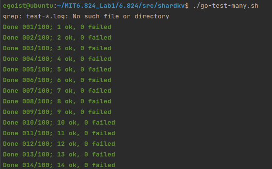
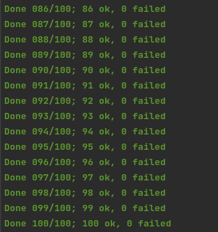

<h1>Lab4</h1>

<h2> Overview </h2>

Finally, we make it to the final lab, no doubt that it's the most challenging work among 4 labs. In this part, we gonna implement two main K-V storage system, one is shardmaster and one is shardkv. The specific service of them will be discussed in FRAMEWORK part, let's talk how much workload this lab may take first.


Compared with former labs, we have no paper to refer to  and no framework to follow. This lab emphasizes more on real producing environment that we need balance load (**so shard comes**) and make shard movable among muti-raft. So *shardmaster* is a configuration center that decides which raft group servers which shards, and *shardkv* is exactly one raft group that need to provide *PUT/APPEND/GET* service to their served shards. (I will put a figure in **conclusion **to make you easier to understanding)


<h2> Lab4A</h2>

Now we are to build shardmaster, which is a group consensus configuration center and records current serving raft groups and which shards one raft group servers. Our task is to adjust shards and dispatch every configuration it receives. The whole design frame is alike as *lab3*, so we can just copy lab3's code and revise some part to satisfy the need of **Rebalance Shards** in each raft group.


So what we gonna do is:

* Build the basic K/V storage system based on lab3
* Design a Shard Rebalance mechanism that meet the lab's request that *The shardmaster should react by creating a new configuration that includes the new replica groups. The new configuration should divide the shards as evenly as possible among the full set of groups, and should move as few shards as possible to achieve that goal. The shardmaster should allow re-use of a GID if it's not part of the current configuration*
* Implement *Join( ), Leave(), Move(), Query()* 


<h3>Implementation</h3>

The whole design is similar to *kvraft*, because we have implemented consistency and deduplicated underlayer, we can just mainly focus on *Join() & Leave( )*. I just simply use the strategy that move one shard from largest group (which owns most shards) to smallest group. The boundary condition is:

* Group 0 should have no shards, which means once group 0 has shard, we should select it as largest group and no select it when its shards is least.
* Every raft group's shards disparity should <= 1


So let's consider query() and move() first:  For query(*idx int*), just return *idx-th* index's config and return latest config if *idx* == -1. **Note : If idx exceeds the array length,  we should return a invalid config for upper layer's double check rather than throwing a exception and exit**. For *move()*, we just move one shard from one raft group to another. No more adjusting needed.


Then Join() and Leave(), these two function have both *Rebalance Shards* part which need we think carefully before coding. There is two allocation strategies: one is that I formerly described and another is *consistent hash*, it is a more realistic way to address *load balance*. (But I just use the straightforward way). Once we decided the *rebalance strategy*, what left is much easier that to handle Join(), we can just append a group has no shard then call *rebalance()*, to handle Leave(), we can just assign left group's shards to group 0 then call rebalance().


Once one of *join, leave, move* is done, append a new config corresponding to it to *configs*.


<h2> Lab4B</h2>

This part takes me longest time to consider whole logic and the same time to debug. So I hope there are some problem to be addressed before programming.


First, what should one *shardKV* do. *shardKV* is a raft group which *shardMaster* previously recorded in config, to make you easier to understand, the normal format is like: "[server-101-0 server-101-1 server-101-2]" which means raft group 101 has 3 raft peers from 0 - 2. So these 3 servers is required to provide Key/Value service for their served shards. So simply speaking, if shards are statistic, a shardKV is just like kvraft.


Second, shards movement. Because shards are not fixed on one group, we should move shard from one group to another, so problem comes that **which information should be delivered and how to make all group remains consistence.**


Third, which operations should be asynchronized in a group. If you haven't have a figure of the whole frame in your head it's OK, but let's image first what we should do in this program. Start with configuration fetch, we should routinely check if there is a newer config then try to update. Then the migration method, it is unwise that once you need to get or send one shard's data, you just stuck and wait for a reply. Third the GC thread, (optional)


Finally, how to achieve consistency on moving shards. It's not hard to answer, we should just use leader to launch every request, use *rf.Start() to record*, once received command in *AppCh*, then start to process the command.


<h3>Implementation</h3>

To pass all test, we should consider Garbage Collection and Non-Stuck service when other shards are pulling. In whole program, we mainly implement ConfigFetch(), ShardMigration(), ShardGC(). All data structure and data stored is involved with these 3 main functions.


<h4>Config Update</h4>

As we discussed above, we will launch a thread to routinely fetch new config. Once we get a new config whose version number is **exactly** current number + 1, then we should set current config as new one. **But here is the problem, how to deal with old data?**  No matter we are gonna fetch shard from shrink group or push shard to escalated group, we both need to know the RPC address by *make_end(server_name string)*. So we need at least one previous config to send RPC call, **but do we need more previous config? ** If we apply every config once we detect a new one, it is likely we haven't pull or push data before config change. So we need to save all previous config, and make sure one version's shard data is all transported then we can recollect the memory. But it is much tremendous compared with another implementation I learned from [Xinyu Tan's Repo](http://tanxinyu.work/6-824/)that, we just wait till all group's all shards are ready. So we can make sure that all group which apply new config are clear with previous shards' data.


<h4>ShardMigration</h4>

For one shard move from one group to another, it is both OK that we can choose pull or push from either side. In my implementation, I choose to pull from shrink group. Now we can consider what data should be stored, like previous lab, we need both *kvtable & ClerkRecord* to deduplicate. It is a general thought we can store these info. for every shard and migrate with shard. Also, we need a status id to notify current status. We need 4 status to mark different states.

* Serving (ready state)
* Pulling (Config changes and this shard is prepared to serve after pulling data from previous one)
* BePulling(Config changes and this shard is prepared to be pulled data by new group)
* GCing (After fetch shard's data, we need a new RPC call to tell previous one to delete shard)


<h4>ShardGC</h4>

For those shards shrunk from previous config to current one, we are respond to recollect these memory. So we design a new mechanism to process GC, which means once new group successfully fetched shard data from previous one, (Pulling -> GCing), there are a thread routinely check *GCing* state and send GC signal to other group to tell it, it's OK to delete data.


<h4> Hints</h4>

* Every shard can receive request from client if they are in *Serving* and *GCing*

* All Thread should check if it's leader, then begin to process formal job

*  To deal with unreliable network, we should use configure number to check if is the right request.

* In GC step, the GCed group should first use Raft record the GC command then delete and send reply.(Or once this time it crashed, no one will notify it to GC again, because the current shard's group has received the reply and turn GCing to Serving)

* Time to detect *Wrong Group*

  * In previous design, we just exam *Sequence number*, but now we should do group exam to block those not serving shard's request
  * It is not enough to exam it at first, just imagine a situation

  ```go
  func (kv *ShardKV) putAndAppend(cmd *Op){
  	key, value, op, cid, seq := cmd.Key, cmd.Value, cmd.Op, cmd.Cid, cmd.Seq
  	kv.mu.Lock()
  	defer kv.mu.Unlock()
  	//shard := key2shard(key)
  	//if ok := kv.checkShard(shard); !ok{
  	//	cmd.Err = ErrWrongGroup
  	//	return
  	//}
  	ok := kv.updateClerkMap(cid, seq, shard)
  	if ok{
  		then ...
  	}
  }
  ```

  

  ​	if we do not exam shard in *Put, Append, Get*, we may have inconsistency consequence

  * Shard have updated(Because of asynchrony flow), and it is now not serving in this group. Data do have *Put, Append, Get* and clerkRecord updated. But it won't be watched in new serving group

So we need a mechanism to tell previous Public interface (Put(), Append(), Get()) that our shards have changed, that there is an ErrWrongGroup out there. Thus I adapted a different way to watch progress of each operation, channel. That every operation gets its channel identified by the return index value of *rf.Start()*. So once the command is executed, the kvraft will notify interface that operation has been done by channel(as well as err).

```go
func (kv *ShardKV) getChan(raftIndex int, create bool)chan Op{
	kv.mu.Lock()
	defer kv.mu.Unlock()
	if _,ok := kv.chanMap[raftIndex]; !ok{
		if !create{
			return nil
		}
		kv.chanMap[raftIndex] = make(chan Op,1)
		return kv.chanMap[raftIndex]
	}
	return kv.chanMap[raftIndex]
}

func (kv *ShardKV) listen(ch chan Op, index int) Op{
	select {
	case op,ok := <-ch:
		if ok{
			close(ch)
		}
		kv.mu.Lock()
		delete(kv.chanMap, index)
		kv.mu.Unlock()
		return op
	case <- time.After(time.Duration(500) * time.Millisecond):
		return Op{Err: ErrWrongLeader}
	}
}
```


Test Result:


100 times tests result:

