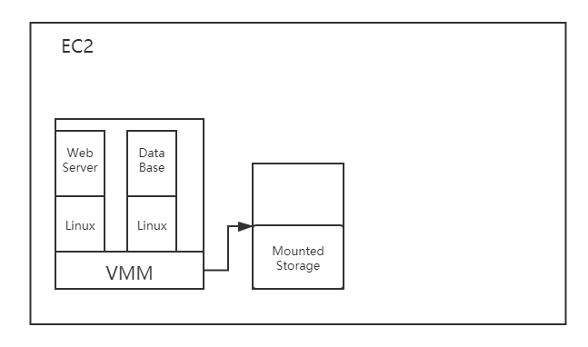
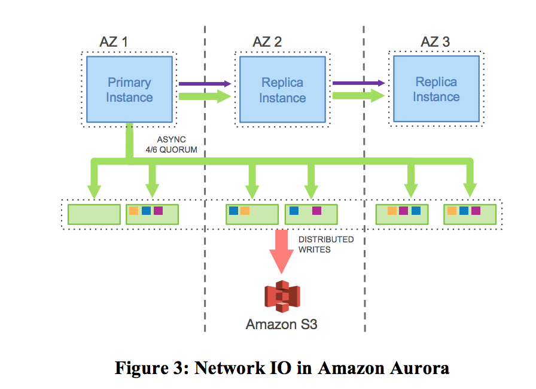

<h1>Aurora</h1>

<h2>Introduce</h2>

Amazon Aurora is a relational database service for OLTP workloads offered as part of Amazon Web Services. Aurora is designed to address the constraint of bottleneck of network throughput, it also allows for fast crash recovery, failovers to replicas and fault-tolerant.


<h2> History</h2>

<h3> EC2</h3>

EC2 is Elastic Cloud 2 for short. Users can rent instances of EC to deploy their Web Server or DB services. 

Each instance of EC2 are running in the Virtual Machine on the physical node, and all their storage is redirected to a external locally attached disk via VMM(Virtual Machine Monitor). 

* For stateless web server, EC2 is convenient for its scalability and high-performance
* For a storage system like DB service, there are bunch of contraint:
  * Limited expansion : MySQL on EC2 is not able to do write expansion
  * Limited fault-tolerance : Once the node fails, we can not access to locally attached disk for data



<h3>EBS</h3>

EBS is Elastic Block Store for short. It is the progress of EC2 that Amazon uses a multiple instances of EBS to do a *Chain-Replication* to have fault-tolerance.


Constraints:

* Network bottleneck because of large amount of data is sending by network
* Not FT, for Amazon always put EBS in same Data Center.


<h3>RDS</h3>

To deal with the constraints mentioned above, Amazon provides a more fault-tolerance system,  Relational Database Service

Compared with EBS, RDS can survive if a whole AZ(Available Zone) fails, but have to send write between primary and replica, which means the performance of write decreases as well as the data of cross-AZ increases dramatically.


<h2> Aurora</h2>

For a new system, Amazon was eager to have both fault-tolerance and performance done well, as following:

* Write although one AZ down
* Read although one AZ down + one replica down
* Minor slow won't affect overall efficiency
* Fast Re-replication



Feature of Aurora:

* Only send log record-- The storage server can apply the log to page, so Aurora can just apply log without applying dirty page, which reduces the network workload
* Only 4 Nodes required to make consensus


<h3>Quorum Scheme</h3>

If we have:

* N Replicas
  * W for Writers' consensus to move
  * R for Readers' consensus to move
* R + W = N +1, this makes sure W & R will get least one overlap


**Example:**

```
N = 3
R = W = 2 or R=3, W = 1
We can adjust speed of R or W by adjusting the number of them
```


In Aurora, N = 6, W = 4, R =3


<h3>Conclusion</h3>

In a word, Aurora optimized data transportation type and used quorum write scheme which got 35 times speeds up compared with RDS's MySQL.


<h2>Extends</h2>

You can find more detailed description of Aurora's work flow in [Amazon Aurora: 避免分布式一致性](https://zhuanlan.zhihu.com/p/319806107) and [浅谈Amazon Aurora](https://zhuanlan.zhihu.com/p/338582762)

