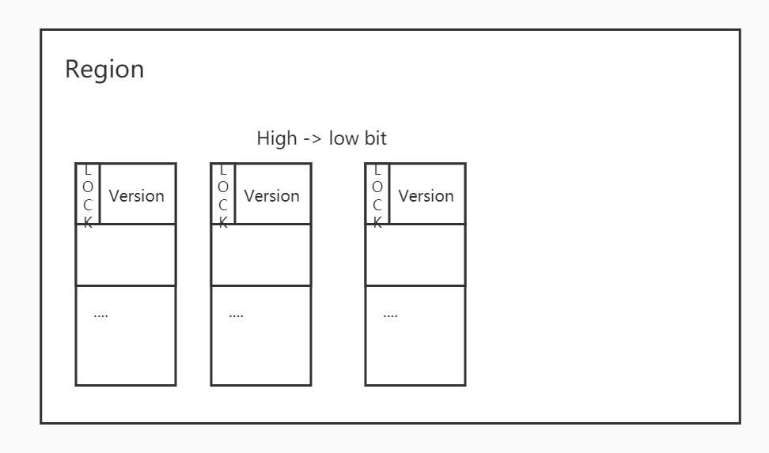
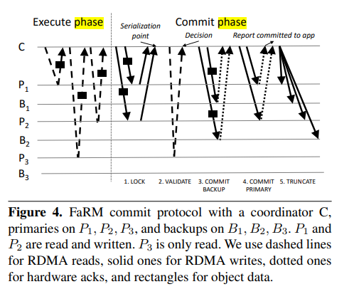

<h1>FaRM (To be updated...)</h1>

<h2>Introduce</h2>

Microsoft's main memory distributed computing platform, FaRM can provide distributed transactions with serializability, high performance, durability, and high availability using RDMA and a new, inexpensive approach to providing non-volatile DRAM.


<h3>NVRAM</h3>

* Strategy to become non-volatile:
  * Using battery as back-up power, once the electric power fails, the system goes with battery and do all context saving work then shut down
  * **Note:** This scheme is just helpful when encounters power failure, is not applicable for hardware/ software failure. --Because otherwise the system just shut down directly.


<h2>Optimistic Concurrency Control</h2>

For a optimistic lock, we have

```
Xaction begin
	read all values without lock
	use a buffer to store write
	commit write
Xaction end
```

Before commit transaction to storage, system need to verify the validation of the transaction. If success, then commit, else abort all the operation related to transaction.

```
tx.create()
o = tx.copyRead(OID)
o.value += 1
tx.write(OID, o)
ok := tx.commt()
```


<h2>Transaction Management</h2>



 

Refer to the above figures about server layout and OCC commit protocol. Let's talk about FaRM's transaction management. FaRM uses OCC and 2PC to achieve its serializability.


**2PC strategy**

*  Read without lock, read(& value, &version)
  * use one-side RDMA to read
* Lock the revised data
  * primary polling for data which is (use DRMA to poll)
    * locked, so send reject
    * VERS changed, then send reject
    * else, then set the lock and send yes.( To avoid racing, use CHECK&SET atomic operation here)
* do validation for those no changed shard
  * To check if version changed or locked]
* Commit