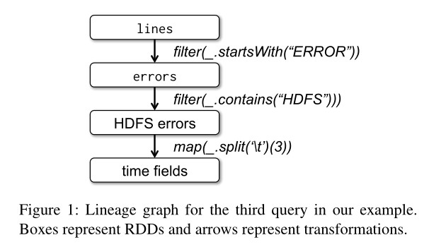
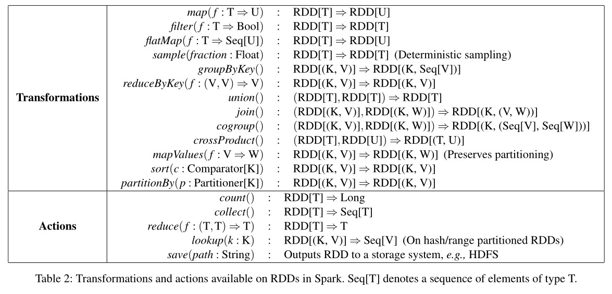
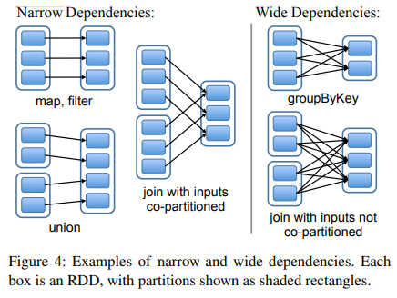
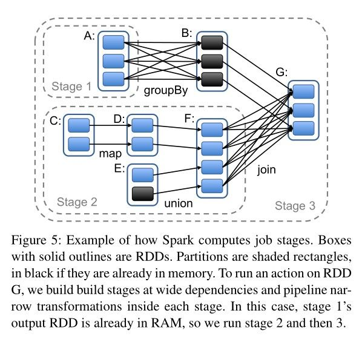

<h1>Spark</h1>

<h2>Introduce</h2>

Spark is a successor of MapReduce to process distributed big-data computing tasks.  Frameworks like MapReduce, Dryad, and Spark help data scientists to focus on their business rather than wasting time on designing the distributed tasks and fault-tolerance. 

There are some constraints in previous frameworks that MapReduce lacks abstractions for leveraging distributed memory so makes it inefficient for those that reuse intermediate results across multiple computations and lacks high interactive flexibility, programmers may have trouble implementing some complex algorithms. 

Spark is an implementation of a new abstraction called resilient distributed datasets(RDDs), which are fault-tolerant, parallel data structures that let users explicitly persist intermediate results in memory, control their partitioning to optimize data placement, and manipulate them using a rich set of operators.


<h2> RDD</h2>

RDD(Resilient Distributed Dataset) is a collection of Read-Only and Partitioned records. RDDs can only be created through deterministic operations on either 1) data in stable storage or 2) other RDDs. Spark uses *Lineage* to keep track of how each RDD is transformed from previous datasets.

Spark provides *Action* as well as *Transformation*. Action calculate RDDs and gets a result. Transformation imports data from external sources or transform an old RDD to a new Read-Only RDD.




<h2>Computation Schedule</h2>

RDDs are stored in distributed servers, so when we need to do Transformation,  systems need to fetch previous RDD in the corresponding servers. There are two kinds of Transformations that forms different dependency between RDDs

* Narrow Dependency : Each partition of the parent RDD is used by at most one partition of  the child RDD.
* Wide Dependency : Multiple child partitions may depend on the parent RDD.



Spark speeds up Transformation by optimizing the Transformations related to *Narrow Dependency*. First, narrow dependencies allow for pipelined execution on one cluster node, which can compute all the parent partitions.  Second, recovery after a node failure is more efficient with a narrow dependency, as only the lost parent partitions need to be recomputed.


In contrast, in a lineage graph with wide dependencies, a single failed node might cause the loss of some partition form all the ancestors of an RDD, requiring a complete re-execution.


Overall, a RDD are consistent of  the following elements:

* Its partitions
* Its parent partitions
* Transformation
* Its metadata(eg, data type, storage position etc.)



When user calls Action to process computation on RDD, Spark will build different stages according to lineages. Hence, Spark can build a job stage that contains as many Narrow Dependencies as possible to speed up the whole system's efficiency. The boundaries of the stages are the shuffle operations required for wide dependencies, or any already computed partitions that can short-circuit the computations of a parent RDD. After building the job stages, Spark then launches tasks to compute missing partitions from each stage until it has computed the target RDD.

While scheduling Tasks, Spark assigns tasks to machines based on data locality. The task will directly be processed by those nodes that is already holds the partition needed in memory. Otherwise, if a task processes a partition for which the containing RDD provides preferred locations(eg, an HDFS file), we send it to those.


<h2>Fault-Tolerance</h2>

Spark can re-compute the content of a failed RDD by dependencies from lineage graph. But there is a wide dependency during the re-computation, which means we have to re-compute all the RDD it depends, also, Spark won't store all the RDD in the memory, or it will soon run out of memory. So we have to manually do persist, if necessary. 

```
rdd.persist(REPLICATE)
```

 


<h2>Conclusion</h2>

Spark RDD has the feature of:

* Store all info directly on memory
* Interactive API
* Find both Narrow and Wide Dependencies, while narrow one is more efficiency
* Have Checkpoint to failover from wide dependency failure


But we still need to be aware that Spark is not a replacement for MapReduce: For those model and algorithms already fit in MapReduce, Spark won't have a more efficient result for them.


<h2