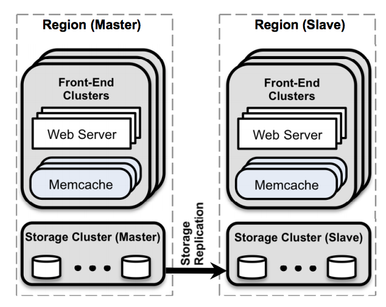
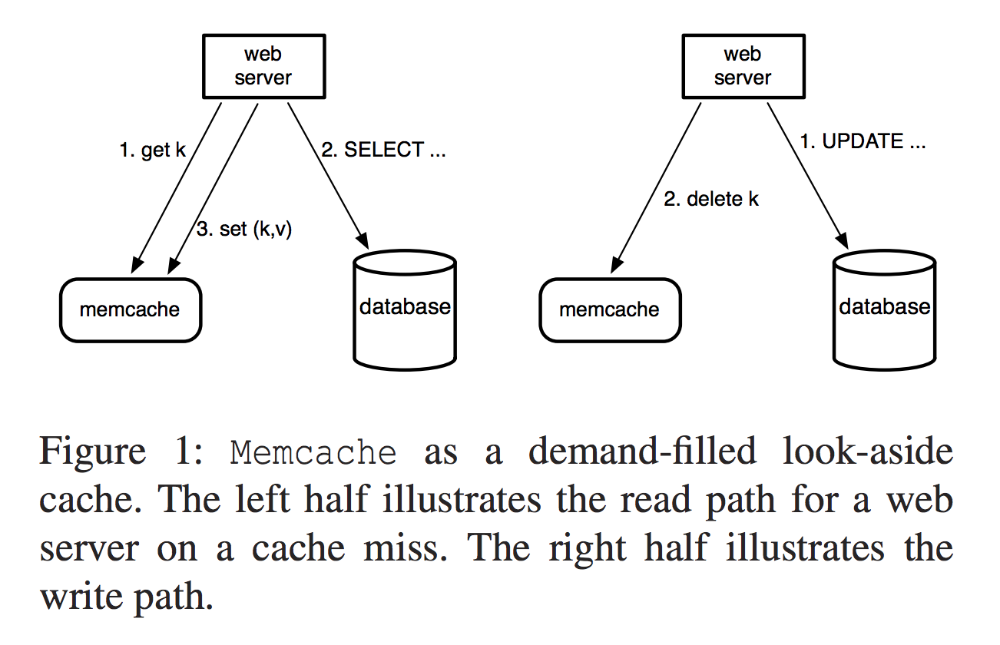

<h1>Memcahce at Facebook </h1>

<h2>Intro</h2>

In a popular webserver scenario, we have web application that clients send request (especially most reads and a few writes) to Data Base, and as we both know things get worse when one peer in the system suffer a throughput bottleneck. To achieve better performance and also get stronger consistency.

* Single Web Server(eg, running on Apache Tomcat) + Single  DataBase(eg, MySQL/ Oracle)

​        &#8595; 

* Muti-Stateless Web Server + Single DB

  &#8595;

* Mutl-Stateless Web Server + DB cluster(sharded  by key, in both scheme and table layer)

​       &#8595;

* Mutl-Stateless Web Server + Memcache (For speeding up reads) + DB cluster


<h2>Implementation</h2>

Facebook noticed that their customers consume an ordered of magnitude more content that they create, so fetching data is the domain element for the performance bottleneck. Also, they have various storage services, like MySQL, HDFS etc, which means a flexible caching strategy is needed.


Finally, they came up with an architecture that separate caching layer from the persistence layer, which means that for a group a Web server, they combine with a group of Memcache to form a *Front-End Cluster*, then a Front-End Cluster combine with a data-completed DB to form a *region*(AKA Data Center). So as the distributed spread of region, users from different area of USA can access to the Web server with lowest latency by choosing different region.



Because of the tolerance of stale message differs in different situation

* User can stand for transient stale data, but not too long
* User tend to observe their latest data after writing it


So the Memcache can achieve eventual consistency by using its R/W strategy.

```
Read Scheme:
	v = get(k)
	if v == nil
		v = fetch from DB
		set(k,v)

Write Scheme:
	send k,v to DB
	delete(k) in MC
```

<h4>Hint</h4>

* This scheme can not prevent users from seeing stale data
  * If user read exactly after *line 8*, at this point, Memcache still holds the stale data but DB has updated the key to the new value
  
* Q: Why not delete key in the MC first before *send k,v to DB*?

  * A: Because if at the time deleted the key in MC but another server did not see key in MC, it will send fetch to DB then may get the stale data that might be deleted afterwards and store to MC. Then MC may store the stale data until another write is fired up.

* Q: Why not just set(k,v) in MV in *line 9*

  * A : Because delete is idempotent while set is not. Check in the example:

  ```
  C1 : x = 1 -> DB
  			C2 : x = 2 -> DB
  				 set(x,2)
  C1 : set(x,1)
  	// makes stale data stored	
  ```

* Prime & Secondary Scheme
  * For many regions, there is one master region and many salve region
  * Local Read and Prime Write
    * For read, each FE read use *Read Scheme* in local region. This is super fast
    * For write, slave's write need to be send to primary region
  * Prime&Secondary replication, primary DB always send info to remote DB to stay in sync


<h2>Performance</h2>

Let's talk about two parallel process strategies.

* Partition
  * increase RAM efficiency that each Key just store once 
  * Not good for  some hot keys
  * Client may talk to many part for one website's resource
* Replication
  * Good for hot key
  * Fewer TCP connection
  * RAM wasted for more replica


For Facebook's architecture, we have two completed replicated asynchronized region that brings fault-tolerance also low-latency for different area's user. In each region, FB partitioned DB then using many Memcache to cache hot keys to reduce DB's load. There is also a regional Memcache cluster in each region to cache those not too hot keys.


<h2> Lease</h2>

 FB uses lease mechanism to fix the *Thunder Herd and Race Condition*.

* Thunder Herd -- If many FE are simultaneously read the same key from Memcache and at this time, one FE do a write() and delete the old key in Memcache. Then DB may have the risk of flooded by too many queries for one key.

* Race Condition -- Example

  ```
  C1 : get(k) -> miss
  C1 : read k from DB -> value1
  			C2 : write k = value2 -> DB
  			C2 : delete(k) to MC
  C1 : set(k,v1) to MC
  // In this situation, stale data of value1 will store on MC forever
  ```

   

  <h4>Solution</h4>

  To each get(k), Memcache server should issue FE a lease for a period of time.

  * Thunder Herd, if one FE get the lease, then others that also send get(k) will block till the first FE calls put(k,v, l) or lease expired
  * Race Condition, C1's get(k) will be issued a lease, but C2's delete will invalid the old lease, the when C1 fetch value1 from DB then calls put(k,v1, l), the Memcache server will reject it.


<h2>Extend</h2>

Another introduce of twitter's cache system in [Twitter 内存缓存系统分析论文阅读](https://tanxinyu.work/twitter-cache-analysis-thesis/)

   
