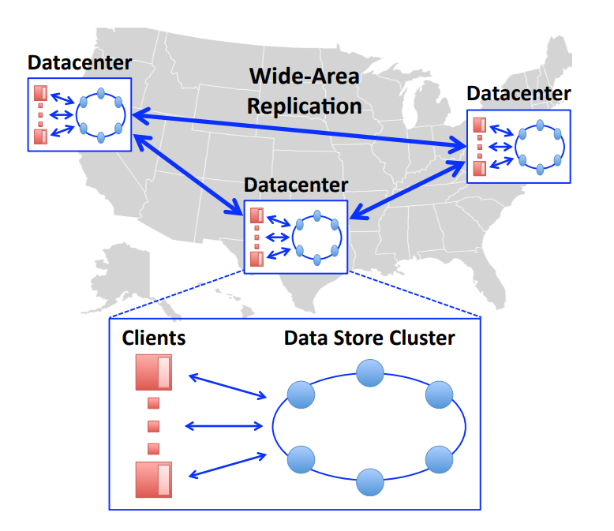
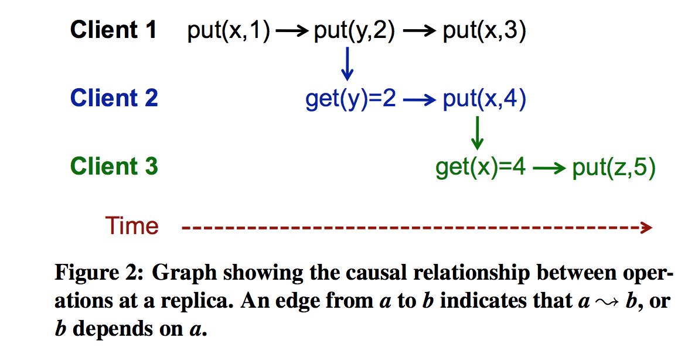

<h1> COPS</h1>

<h2>Introduce</h2>

Still the website Front-End read from DB storage cluster model. We are gonna explore another possibility as local read and local write to speed up transactions. How to achieve *stronger* Consistency in terms of CAP Theorem.


Consider [Spanner](./13.Spanner(Strong Consistency RW).md) and [Memcache](./16.Memcache(Cache Consistency).md)'s scheme

* Spanner

> Linearizability
>
> For R/W transaction, Use PAXOS and 2PC to write to remote replication. (Wait for quorum's acknowledge)
>
> For R/O transaction, read from local. Use Snapshot Isolation and TrueTime clock mechanism to ensure local serializability.

* Memcache

> Eventual Consistency
>
> Introduce memcache layer to achieve write to DB and read from memcache.
>
> Write need receive DB's acknowledge and read has no need to wait.


For COPS,  it figures out a new way to make more efficient read and write by implementing *causal consistency*, which is stronger than eventual consistency but weaker than linearizability.


<h2>Implementation</h2>




COPS, aka Cluster of Order-Preserving Servers, a key-value store that delivers causal-consistency model across the wide-area. Every Data Center has a local COPS cluster, which maintains a complete replica of stored data. So client can just talk to local cluster for data's read and write.


In each Data Center, data are divided into many shards, which is linearizable and clients access each partition independently. So the whole cluster is linearizable as well. The problem comes when clusters communicate with each other to remain sync. 


To achieve causal consistency, COPS have a prime node be responsible for local writing. After local writing is finished, prime will send it to other cluster's prime node, and a version number will be sent as well to keep causal order.


<h2> Causality</h2>

​     *Potential Causality definition* 

* **Execution Thread**. If a and b are two operations in a single thread of execution, then a -> b if operation a happens before operation b

* **Gets From**. If a is a put operation and b is a get operation that returns the value written by a, then a -> b
* **Transitivity**. For operations a, b, and c, if a -> b and b -> c, then a -> c


**Example**:



We can learn from the figure that *put(z,5)* is derived from *get(x) = 4*, which means to execute *put(z,5)* we have ensured that what is logically happened earlier than it. 


**Note:** If the system can not tell weather two operation's happening order, since there is no explicit reason about they, We can simply define they are concurrent, so system can decide the order they happen. But for two *put* concurrently write to the same key, there is a conflict.

So to deal with conflicts, `Last write win` is a proper way to deal with it but if we want to do`append & atomical count` like thing, this strategy may not work.


<h2> Context</h2>

Each client maintains a context to explicitly mark their state. After each operation, the client will append a entry of keys' version. So DC can  simply use this entries to verify the dependencies of one operation.


**Example**:

We have 3 Data Centers, and one client calls put(Z, value, Zver3, Xver2, Yver4) to put Z = value. To forward this operation to other DC, DC1 will check the dependencies of Zver3, Xver2, Yver4 in other DC, if others' are not in this stage, it will wait till other DCs reach or exceed the dependencies' version number


<h2>Lamport Timestamp</h2>

To achieve global order, COPS use `Lamport Timestamp in higher bits + unique ID For Data Center in lower bits` . Combining with Logical timeclock and Wall Clock, we can give a global sequence despite of large inaccuracy.

```
Tmax = highest version seen (from self and others)
T = max(Tmax + 1, wall-clock time)
```


<h2>Write</h2>

Client -> Local Data Store Cluster -> other DCs


When client sends a *put(key, value ...)* , client library will calculate the dependencies according to the context. The local prime will wait till cluster has indeed store all the dependencies( check by version number). Then send to remote clusters, do the same.


<h2>Read</h2>

Read from local cluster, the library function provide both read the latest version of key and a specific older one by explicitly send a context with get.


<h2> limitation </h2>

* Causal Consistency can not be aware of external dependency. For example, Alice told Bob to check a new status of the key, and then Bob sent a get request via client. Now Bob may see old value of key because the system do not know that Alice calls Bob yields Bob's get request.

  And this is also discussed by lamport in <Time, Clocks, and the Ordering of Events in a Distributed System>

* It's hard to manage conflict, `Last write win` is not generic 