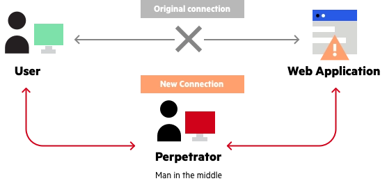
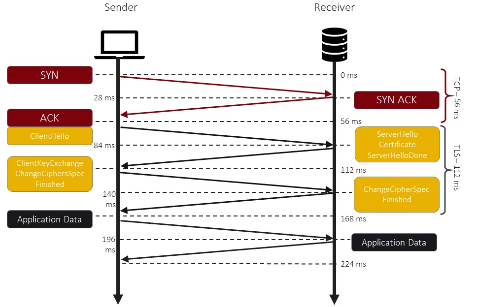
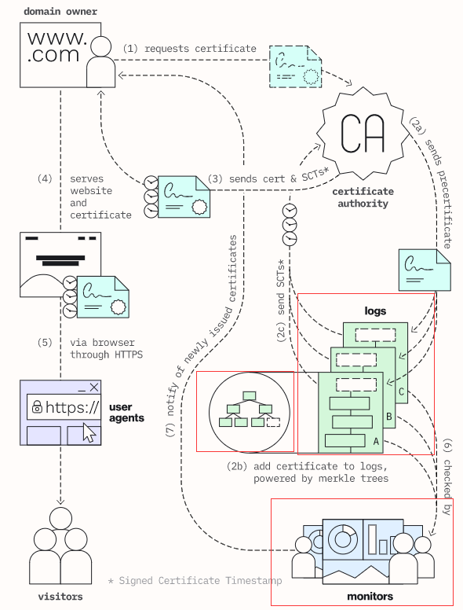
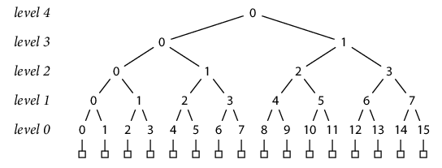
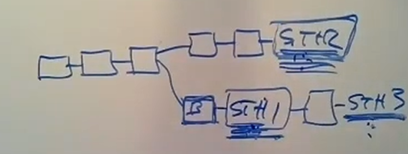

<h1> Certificate Transparency</h1>

<h2>Introduce</h2>

First review the vulnerability of HTTP and an example of  Man in the Middle Attack.

<h4> HTTP</h4>

> HTTP is a request response protocol to communicate asynchronously between client and server.
>
> For websites and pages the browser acts as a client and a web-server like Apache or IIS acts as server. The server hosts the files (like html , audio , video files etc) and returns are responds to client requests with the data. Depending on the request a response contains the status of the request.
>
> The process involves a series of messages that go back and forth between the client and server. The process starts with initiating a connection. After that a process known as TCP slow start kicks in. At this point data is passed between the two parties via data packets and often requires multiple round trips.
>
> TCP slow start is designed to gradually expand the amount of data traversing the wire each round trip. The initial packet size is 16kb and doubles on subsequent round trips until a max size is reached. This can vary, but tends to be around 4MB for most connections.
>
> This process is used because the server does not know how much bandwidth the client can handle. Rather than overflowing the client the server uses a gentle size and continues to increase until a limit is found.
>
> As data or request bodies move between the client and the server it is done using clear or plain text. This is viewable by anyone or software watching the network traffic.
>
> This is not that important for general content. However, today even when you don't think sensitive data is moving between the two parties more sessions do transport identifying information. This is why every website should use TLS to secure HTTP connections.

<h4> Man in the Middle Attack</h4>



A third-party may easily hijack the connection towards target website and redirect to its own rogue web, for no further check mechanism in HTTP.

<h4>Certificate, SSL, TLS, HTTPS</h4>

**HTTPS work flow:**



Particularly, server should request a certificate from *CA(Certificate Authority)*. Whenever client send a connection request to server, it will receive a CERT from server.

| Certificate                  |
| ---------------------------- |
| Server name, eg: "gmail.com" |
| Public Key of server         |
| CA's Signature               |


CA's unique signature ensures that just CA can issue the certificate to server that no one else can counterfeit.


**NOTE:** A vulnerability of this scheme is that once a CA was broken into or something else happened and caused CA issued a malicious certificate. Client may have chance to talk to a rogue web and info may get leaked.


<h2>Certificate Transparency</h2>

Certificate Transparency is a system that stores certificate logs which are stored distributed and append-only on CT. CT can provide user certificate verification to keep CA from issuing malicious certificate and the certificate even keep in CA for longer time.



CT promises following:

* Certificates are deposited in public, transparent logs
* Logs are cryptographically monitored


<h3>Implementation</h3>

Each certificates are stored as a node in Merkle Tree in CT. 

Each node in each level is the value of the output of *cryptographic hash function* that maps an arbitrary-size message *M* to a small fixed-size output H(*M*), with the property that it is infeasible in practice to produce any pair of distinct messages *M1* ≠ *M2* with identical hashes H(*M1*) = H(*M2*). And the we have

```
h(0, K) = H(record K)
h(L+1, K) = H(h(L, 2 K), h(L, 2 K+1))
```

With the property of above, we can determine whether a specific certificate stored in the tree, we can recompute hash(*the certificate*) and the hash value of its siblings and relatives to finally get the top-level's hash. If H(4,0) == recomputed H(4,0), then proved.


**Example:**

For example, suppose we want to prove that a certain bit string *B* is in fact record 9 in a tree of 16 records with top-level hash *T*. We can provide those bits along with the other hash inputs needed to reconstruct the overall tree hash using those bits. Specifically, the client can derive as well as we can that:

```
T = h(4, 0)
= H(h(3, 0), h(3, 1))
= H(h(3, 0), H(h(2, 2), h(2, 3)))
= H(h(3, 0), H(H(h(1, 4), h(1, 5)), h(2, 3)))
= H(h(3, 0), H(H(H(h(0, 8), h(0, 9)), h(1, 5)), h(2, 3)))
= H(h(3, 0), H(H(H(h(0, 8), H(record 9)), h(1, 5)), h(2, 3)))
= H(h(3, 0), H(H(H(h(0, 8), H(B)), h(1, 5)), h(2, 3)))
```


<h3> Fork Attack (Fork Consistency)</h3>

The proof of fork consistency, image a log servers have a chain of logs and once the log server wants to fork (like, to trick a user for a malicious certificate but not seen by other monitors etc.) CT has a mechanism to detect the inconsistency by *gossip*



Like the example, once a log server has a fork line that starts with B for bogus and have a current STH(signed tree head, the top-level hash value). We can simply calculate if STH1's log a prefix log of STH2's log by the same way prove if STH1's log is inside STH2's log tree.

If return a false, which means STH1 is on a different fork.