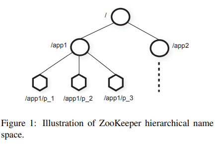
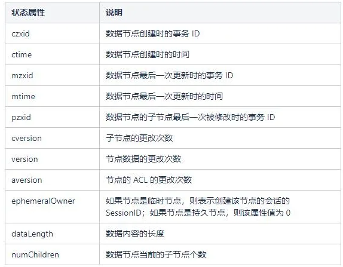

<h1>ZooKeeper(To be continuely updated)</h1>

<h2>Introduction</h2>

ZooKeeper is a very popular service for coordinating processes of distributed applications, it provides a simple and high performance kernel for building more complex coordination primitives. We users can deploy ZK in many distributed applications like, services registration and discovery, cluster management as a coordinator.

ZooKeeper has the following features:

* Sequential Consistence

   All client see the same data that one client's transactions will applied on ZK in its original order

* Atomicity

* Single View

  Clients see the same data no matter it talk to which server

* High performance
* High availability

<h2>Implementation</h2>

The node in the tree is called *znode*, which stores data and node information. The main task for ZK is to coordinate but not file storage, so znode's file size is smaller than 1MB

There are two types of znode

* Ephemeral : ZK will automated delete it, after session finishes
* Persistent : Need client to delete explicitly

<h3>Node information</h3>

Znode has a *sequential* flag, it will be issued a monotonically increased number  if flag is true when created, to mark the global sequential order of the znode. It also maintains a state information table call *Stat*.

<h3>Sequential Consistency</h3>

To achieve sequential consistency, ZK uses its own ZAB consensus algorithm, like Raft and Paxos in implementation but different in some details.

ZK guarantees the **single client** FIFO transactions order. For R/W, ZK has different rules

* For reads, Leader/Follower/Observer all can directly handle read request. (read locally)
* For write, all writes requests need to send to leader then wait till reaching consensus.

**Note:** For those need read a fresh data, client may send a <sync> to leader, then send read to replica.

<h2> Conclusion</h2>

This is a simply discussion about ZK, I am just dabble in distributed systems, so I will keep updating this article as my concept of ZK grows 