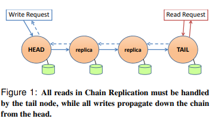

<h1>CRAQ</h1>

<h2>Introduce</h2>

Start with awareness that Paxos, Raft's consensus algorithms have bottleneck in leader, because leader need to send logs to all followers and wait for majority of their reply.

Chain replication is purposed in 2004, its scheme ensures serializability meanwhile the whole workload is distributed among the system(to each node).

CRAQ is an improvement on Chain Replication, maintains strong consistency while greatly improving read throughput. **But in this article, I will just mainly talk about Chain Replication.**

<h2>Chain Replication</h2>

Use the chain on Figure 1 and a remote coordinating cluster like ZK, Raft or Paxos to check heartbeat and send configurations to nodes on the chain.

 <h3>Failure Recovery</h3>

* Head fails: Its successor becomes head
* Tail fails: Its predecessor becomes tail
* Intermediate fails: predecessor send MSG to its successor

<h3> Evaluation </h3>

* Pros:
  * Head's workload is far less than Raft's leader's. Because leader needs to send sync. packets and handle R/W log
* Cons:
  * Every node can slow down the whole system. Raft, instead, just need a majority of nodes keep running.

<h2> Extend</h2>

To read more about CRAQ, you may find articles in [浅谈Primary-Back Replication和Chain Replication](https://zhuanlan.zhihu.com/p/344808961)

